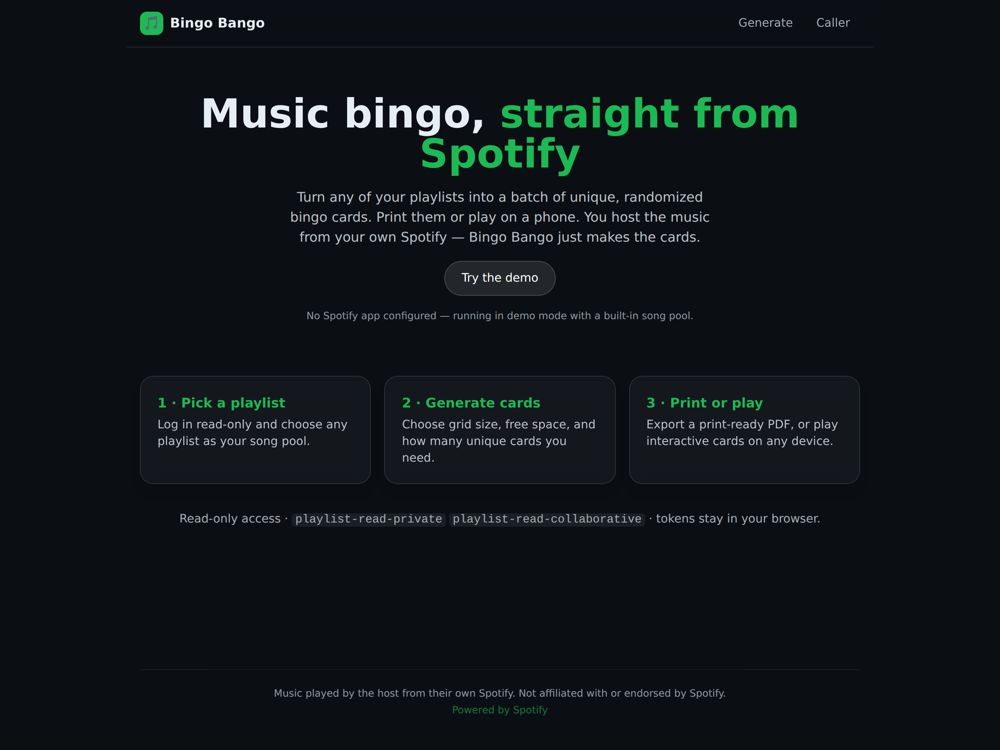
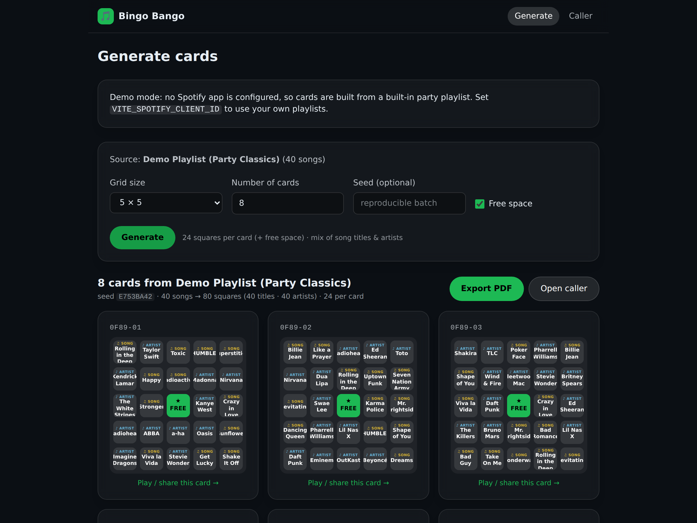
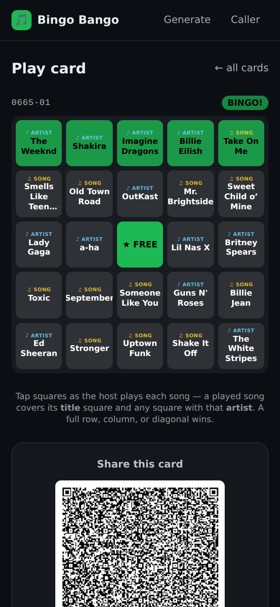

# Bingo Bango 🎵

**Generate printable & on-screen music bingo cards from your own Spotify playlists.**

Bingo Bango is a client-only web app (SPA/PWA) that turns any of your Spotify
playlists into a batch of unique, randomized music-bingo cards. It runs entirely
in the browser — there is no backend and no server to run — so it can be hosted
for free as static files.

---

## Screenshots

|                         Landing                          |                          Generate a batch                          |                        Play + share (mobile)                        |
| :------------------------------------------------------: | :----------------------------------------------------------------: | :-----------------------------------------------------------------: |
| [](docs/screenshots/home.png) | [](docs/screenshots/generate.png) | [](docs/screenshots/play-mobile.png) |

_Shown in demo mode (built-in party playlist). Interactive card with a completed
top row → BINGO, plus a shareable QR code._

---

## What is music bingo?

Music bingo (a.k.a. "musical bingo" or "song bingo") is a party game that swaps
the numbers on a traditional bingo card for **songs**.

1. **The host** builds a pool of songs — here, straight from a Spotify playlist.
2. Every player gets a **bingo card** whose squares are songs (title + artist)
   drawn randomly from that pool. Every card is different.
3. The host **plays songs** from the playlist in a random order (from their own
   Spotify — a phone, a speaker, whatever they like).
4. When a player recognizes a song that's on their card, they **mark that
   square**.
5. The first player to complete a line (row, column, or diagonal) — or whatever
   winning pattern the host chose — yells **"Bingo!"** and wins.

Bingo Bango's job is step 2: it generates the cards. The host still plays the
music from their own Spotify account — the app never needs to stream or play
audio.

---

## Approach

Bingo Bango is intentionally small and cheap to run:

- **Client-only SPA/PWA — no backend.** Everything (auth, playlist fetching,
  card generation, PDF export) happens in the browser. It can be deployed to any
  static host (GitHub Pages, Vercel, Netlify) at ~$0 cost.
- **Spotify Authorization Code with PKCE.** Because there is no server, we use
  the PKCE OAuth flow, which needs **no client secret**. Access tokens live only
  in the browser and never touch a server we control.
- **Read-only Spotify scopes.** We request only
  `playlist-read-private` and `playlist-read-collaborative` — enough to list and
  read the user's playlists, nothing more.
- **Each bingo square is a song title _or_ an artist**, drawn from the playlist
  and mixed on the card. When the host plays a song it covers that song's title
  square **and** any square with that song's artist. The **host plays the music**
  from their own Spotify; the app only generates cards.
- **In-app preview playback is out of scope.** Spotify
  [deprecated `preview_url`](https://developer.spotify.com/blog/2024-11-27-changes-to-the-web-api)
  for new apps in November 2024, so we don't rely on 30-second previews. It's
  noted as a possible later stretch goal only.

### Tech stack

| Concern        | Choice                                         |
| -------------- | ---------------------------------------------- |
| UI             | React + Vite + TypeScript                      |
| Styling        | Tailwind CSS                                    |
| Tests          | Vitest                                          |
| Card engine    | Pure, dependency-free TypeScript module        |
| Auth           | Spotify Authorization Code + PKCE              |
| Hosting        | Static files (GitHub Pages / Vercel / Netlify) |

See [`docs/SCOPE.md`](docs/SCOPE.md), [`docs/ARCHITECTURE.md`](docs/ARCHITECTURE.md),
and [`docs/ROADMAP.md`](docs/ROADMAP.md) for the full plan.

---

## Features

- **Log in with Spotify** (read-only, PKCE — no client secret) and pick any of
  your playlists as the song pool.
- **Demo mode**: no Spotify app configured? The app runs on a built-in party
  playlist so you can try everything without credentials.
- **Title & artist squares** — every square is either a song title or an artist,
  mixed roughly half-and-half; a played song marks its title square and any of
  its artist squares ("both facets").
- **Generate unique cards** — choose grid size (3×3 / 4×4 / 5×5), free space,
  how many cards, and an optional seed for reproducible batches.
- **Print-ready PDF export** (one card per page).
- **Interactive digital cards** with tap-to-mark and automatic **BINGO
  detection** (row / column / diagonal).
- **Caller screen** that draws songs in a deterministic shuffled order.
- **Share a card** via link + **QR code** — the card is encoded in the URL, so it
  opens on any device with no backend.
- **Installable PWA** with an offline app shell; mobile-first and theme-aware.

## Project status

**All milestones (M0–M5) are implemented.** The pure card engine
([`src/cards/`](src/cards/)) is fully unit-tested; the Spotify integration, React
UI, PDF export, PWA, and interactive play are built on top of it. See the
[roadmap](docs/ROADMAP.md) for the milestone breakdown and
[`docs/ARCHITECTURE.md`](docs/ARCHITECTURE.md) for how it all fits together.

---

## Getting started (developers)

Requires Node 18+.

```bash
npm install        # install dependencies
npm run dev        # start the Vite dev server
npm run build      # typecheck + production build to dist/
npm run preview    # preview the production build
npm test           # run the Vitest suite
npm run typecheck  # type-check with tsc --noEmit
npm run demo       # print 3 sample cards from a mock 40-song pool
```

### Using your own Spotify playlists

The app works in **demo mode** out of the box. To use real playlists:

1. Create an app at the
   [Spotify Developer Dashboard](https://developer.spotify.com/dashboard).
2. Add redirect URIs that match where you run the app, e.g.
   `http://127.0.0.1:5173/callback` for local dev and
   `https://<user>.github.io/bingo-bango/callback` for GitHub Pages.
3. Copy [`.env.example`](.env.example) to `.env` and set
   `VITE_SPOTIFY_CLIENT_ID`. Under PKCE the client id is **public**, not a secret.

### Deploying

`npm run build` emits static files to `dist/` — host them anywhere. A
[GitHub Actions workflow](.github/workflows/deploy.yml) builds and deploys to
GitHub Pages on every push to `main` (set `BASE_PATH` for the project subpath;
it's handled automatically in CI). Vercel/Netlify work too and handle SPA
routing without extra config.

### Using the card engine directly

The card engine lives in [`src/cards/`](src/cards/) and is usable on its own,
with no Spotify or DOM dependencies:

```ts
import { generateCards } from './src/cards/index.js';

const result = generateCards(songs, {
  gridSize: 5,
  freeSpace: true,
  count: 30,
  seed: 'optional-seed-for-reproducibility',
});
// result.cards -> BingoCard[]
```

---

## License

[MIT](LICENSE) © Bingo Bango contributors.

_Not affiliated with or endorsed by Spotify. "Spotify" is a trademark of Spotify
AB._
